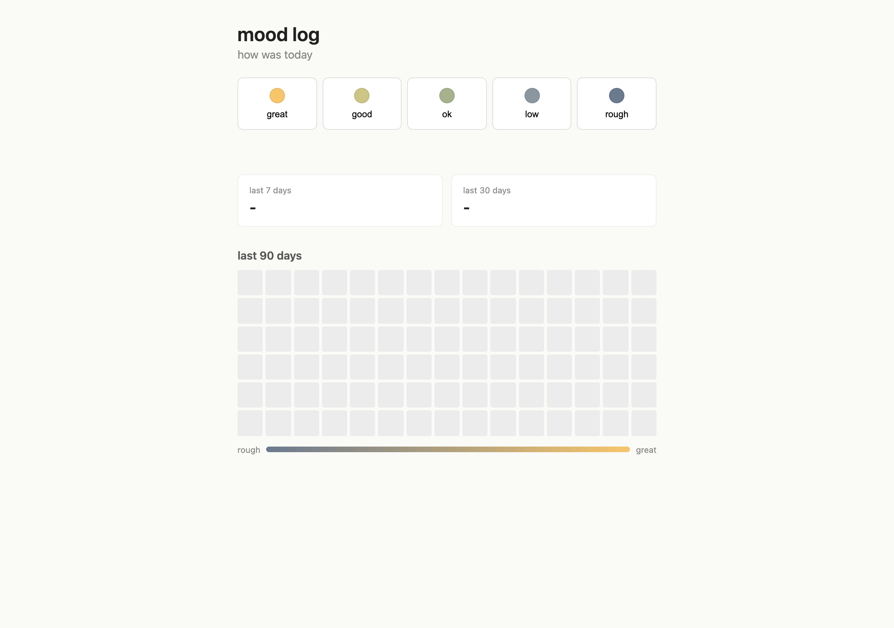

# mood-log



a tiny page to log my mood each day and see a heatmap of the last few months. made this on a quiet weekend while learning js, partly because i kept forgetting how the week actually felt by friday.

## what it does

- pick a mood from 5 levels: great, good, ok, low, rough. each level has its own color swatch.
- one entry per day. if you change your mind you can just click again and it overwrites today.
- everything stored in localStorage, no backend.
- shows a 90 day calendar heatmap where each cell is colored by that day's mood.
- shows the average mood for the last 7 and last 30 days.

## the math bit

mood values are scaled 1 to 5. average is just the plain mean of however many days are filled in that window. heatmap colors are a linear interpolation between two color stops based on the mood value, so a 3 lands halfway between the low and high color.

## how to run it

no build step.

```
git clone https://github.com/secanakbulut/mood-log.git
cd mood-log
open index.html
```

or just double click index.html.

## files

- index.html
- style.css
- app.js

## license

PolyForm Noncommercial 1.0.0. fine for personal use, not for selling.
